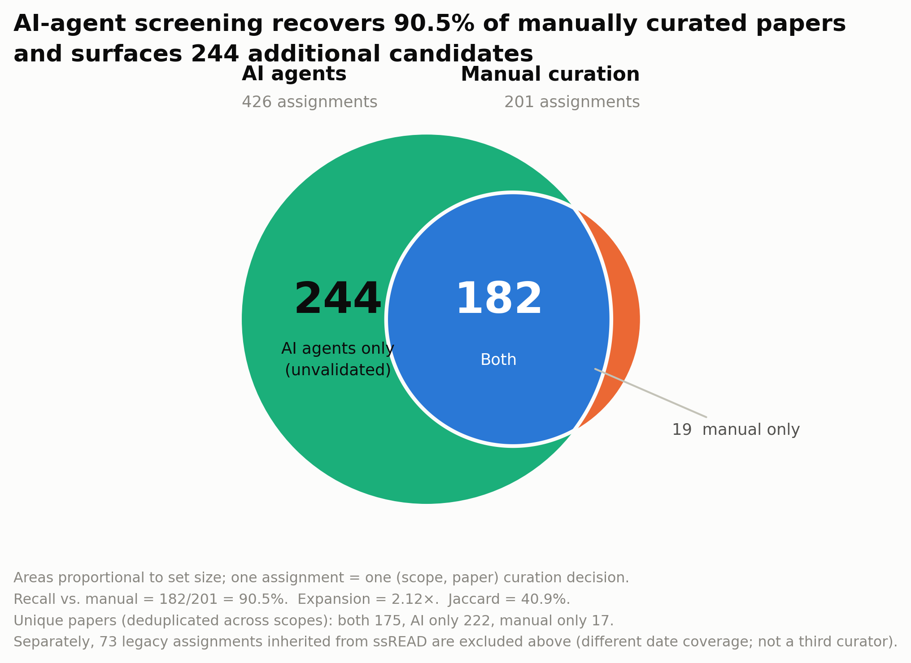
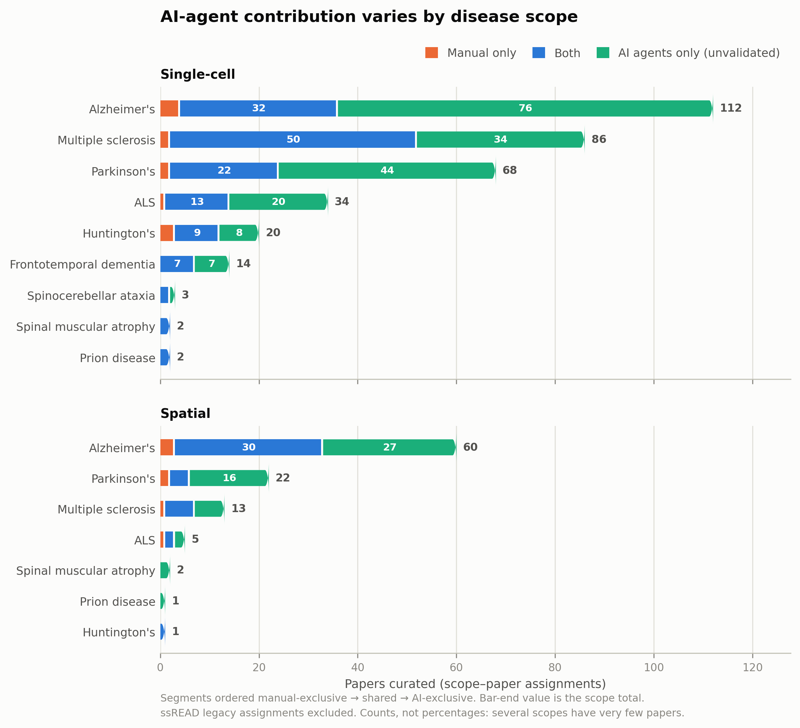
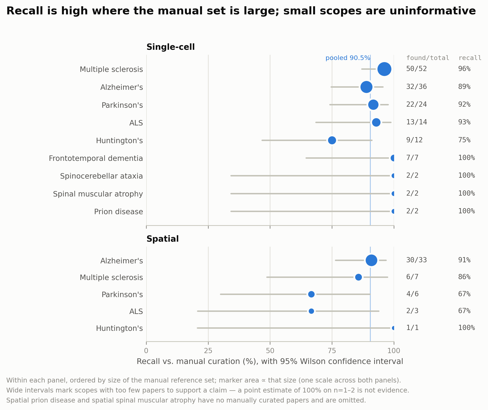

<!-- Generated by analysis/curation_figures.py — do not edit by hand. -->

# Curation Benchmark — AI Agents vs. Manual Curation

## Overview

Pipeline 1 screens PubMed papers with two LLM steps (`IdentifyOriginalDataStep`,
`IdentifyRelevanceStep`) and accepts a paper only when both return `True`. This
document benchmarks that automated screening against manual curation across
**16 scopes** (9 single-cell, 7 spatial).

Source data: `data/20260413-results-analysis/*.txt`, one file per scope, each
partitioned into four sections:

| Section | Meaning |
|---|---|
| `## Overlap` | Curated by **both** the AI agents and manual review |
| `## Only in ai-agents` | Curated by the AI agents alone |
| `## Only-in-manual` | Curated by manual review alone |
| `## inherit from ssREAD` | Inherited from the earlier ssREAD collection |

**The unit of analysis is a scope–paper assignment**, i.e. one (scope, paper)
curation decision — not a unique paper. 39 PMIDs legitimately appear
under more than one scope (a paper can be both Alzheimer's single-cell and
Alzheimer's spatial). Unique-paper counts are given alongside where relevant.

## Headline result



**Figure 1. AI-agent screening recovers 90.5% of manually curated papers and
surfaces 244 additional candidates.** Circle areas are proportional to set size;
the intersection is solved numerically so the geometry is faithful. The manual
set sits almost entirely inside the AI set.

| Metric | Value |
|---|---|
| Recall vs. manual | **90.5%** (182/201), 95% CI 85.7–93.9% |
| Expansion factor | **2.12×** (426 AI vs. 201 manual assignments) |
| Jaccard similarity | 40.9% |
| Found by both | 182 |
| AI agents only (unvalidated) | 244 |
| Manual only (agent misses) | 19 |
| Unique papers | both 175, AI only 222, manual only 17 |

## Per-scope composition



**Figure 2. AI-agent contribution varies by disease scope.** Segments are ordered
manual-exclusive → shared → AI-exclusive; the value at the bar end is the scope
total. Absolute counts are shown rather than percentages because several scopes
contain very few papers. The largest relative expansion is
**Parkinson's (spatial) at 3.33×**.

## Recall with uncertainty



**Figure 3. Recall is high where the manual set is large; small scopes are
uninformative.** Faceted by modality, ordered within each panel by the size of the
manual reference set, with marker area proportional to that size (one scale
across both panels). Error bars are 95% Wilson score intervals, which stay
correct at small *n* where the normal approximation fails.

The strongest evidence comes from Multiple sclerosis (single-cell): 96.2% recall on
n=52. Conversely a point estimate of 100% on n=1–2 carries an interval
spanning most of the range and should not be read as a result.

## Table 1 — per-scope detail

| modality | disease | n_manual | n_ai | overlap | ai_only | manual_only | recall_pct | ci95_low | ci95_high | expansion | ssread_legacy |
|---|---|---|---|---|---|---|---|---|---|---|---|
| Single-cell | Multiple sclerosis | 52 | 84 | 50 | 34 | 2 | 96.2 | 87.0 | 98.9 | 1.62 | 1 |
| Single-cell | Alzheimer's | 36 | 108 | 32 | 76 | 4 | 88.9 | 74.7 | 95.6 | 3.00 | 57 |
| Single-cell | Parkinson's | 24 | 66 | 22 | 44 | 2 | 91.7 | 74.2 | 97.7 | 2.75 | 3 |
| Single-cell | ALS | 14 | 33 | 13 | 20 | 1 | 92.9 | 68.5 | 98.7 | 2.36 | 0 |
| Single-cell | Huntington's | 12 | 17 | 9 | 8 | 3 | 75.0 | 46.8 | 91.1 | 1.42 | 0 |
| Single-cell | Frontotemporal dementia | 7 | 14 | 7 | 7 | 0 | 100.0 | 64.6 | 100.0 | 2.00 | 2 |
| Single-cell | Prion disease | 2 | 2 | 2 | 0 | 0 | 100.0 | 34.2 | 100.0 | 1.00 | 0 |
| Single-cell | Spinal muscular atrophy | 2 | 2 | 2 | 0 | 0 | 100.0 | 34.2 | 100.0 | 1.00 | 0 |
| Single-cell | Spinocerebellar ataxia | 2 | 3 | 2 | 1 | 0 | 100.0 | 34.2 | 100.0 | 1.50 | 0 |
| Spatial | Alzheimer's | 33 | 57 | 30 | 27 | 3 | 90.9 | 76.4 | 96.9 | 1.73 | 9 |
| Spatial | Multiple sclerosis | 7 | 12 | 6 | 6 | 1 | 85.7 | 48.7 | 97.4 | 1.71 | 0 |
| Spatial | Parkinson's | 6 | 20 | 4 | 16 | 2 | 66.7 | 30.0 | 90.3 | 3.33 | 1 |
| Spatial | ALS | 3 | 4 | 2 | 2 | 1 | 66.7 | 20.8 | 93.9 | 1.33 | 0 |
| Spatial | Huntington's | 1 | 1 | 1 | 0 | 0 | 100.0 | 20.7 | 100.0 | 1.00 | 0 |
| Spatial | Prion disease | 0 | 1 | 0 | 1 | 0 | n/a | n/a | n/a | n/a | 0 |
| Spatial | Spinal muscular atrophy | 0 | 2 | 0 | 2 | 0 | n/a | n/a | n/a | n/a | 0 |
| **ALL** | **Total** | 201 | 426 | 182 | 244 | 19 | 90.5 | 85.7 | 93.9 | 2.12 | 73 |

Also available as [`table1_per_scope.csv`](../analysis/figures/table1_per_scope.csv) for
spreadsheet import.

## Interpretation limits

Three constraints bound what these figures can claim.

**1. Precision is not computable — and is deliberately absent.** The 244
AI-only papers have not been manually adjudicated. Recall against the manual set
is measurable because the manual set is a reference; precision is not, because
"the agent found something the humans did not" is not evidence of an error. No
precision, F1, or accuracy figure appears anywhere in this analysis. Treating
the AI-only set as false positives would invert the purpose of the pipeline.

**2. ssREAD is not a third curator.** The 73 inherited assignments come from
the earlier ssREAD collection, which has different date coverage, and are
excluded from every comparison above. They are disjoint from the Overlap section
in all scopes where they appear.

**3. Small scopes carry no weight.** 2 scopes have no manually curated
papers at all (Prion disease (spatial), Spinal muscular atrophy (spatial)) and are omitted from
Figure 3. Several more have n ≤ 3, where the confidence interval spans most of
the range.

### Recommended next step

Manually adjudicate a random sample of ~50 of the 244 AI-only papers. That
single exercise converts an unvalidated candidate set into a precision estimate
with a confidence interval, and is the one missing piece needed to state a
performance claim rather than a coverage claim.

## Data quality

The source files required 8 corrections, applied automatically and logged in
full to [`data_quality_report.txt`](../analysis/figures/data_quality_report.txt). PMIDs listed in
more than one section of the same file are resolved by the precedence
`overlap > manual_only > ai_only > ssread`.

Issues found:

- `single-cell-frontotemporal-dementia-result-20260723.txt: PMID 38521060 appeared in both [ai_only] and [ssread] - assigned to [ai_only] by precedence`
- `single-cell-frontotemporal-dementia-result-20260723.txt: PMID 37714849 appeared in both [ai_only] and [ssread] - assigned to [ai_only] by precedence`
- `single-cell-parkinson-result-20260723.txt: PMID 39138468 appeared in both [ai_only] and [ssread] - assigned to [ai_only] by precedence`
- `single-cell-parkinson-result-20260723.txt: PMID 36993867 appeared in both [ai_only] and [ssread] - assigned to [ai_only] by precedence`
- `single-cell-parkinson-result-20260723.txt: PMID 35700056 appeared in both [ai_only] and [ssread] - assigned to [ai_only] by precedence`
- `single-cell-parkinson-result-20260723.txt: PMID 34919646 appeared in both [ai_only] and [ssread] - assigned to [ai_only] by precedence`
- `single-cell-spinocerebellar-ataxia-result-20260723.txt: PMID 38016472 appeared in both [overlap] and [manual_only] - assigned to [overlap] by precedence`
- `single-cell-spinocerebellar-ataxia-result-20260723.txt: PMID 39504355 appeared in both [overlap] and [manual_only] - assigned to [overlap] by precedence`

These are defects in the source `.txt` files and are worth fixing upstream — the
first one alone shifts the headline recall figure.

## Reproducing

```bash
eval $(poetry env activate)
python analysis/curation_figures.py
```

Regenerates every figure (PNG at 300 dpi + vector PDF), the tables, the data
quality report, `stats.json`, and this document. All numbers quoted above are
interpolated from the parsed data at generation time, so the prose cannot drift
out of sync with the figures.
